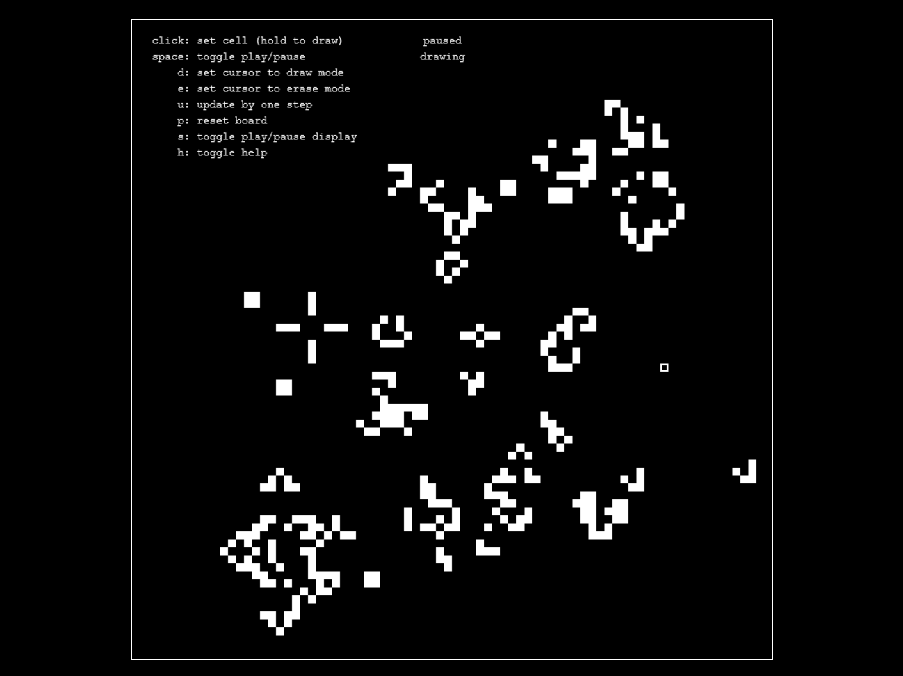

# game-of-life
Interactive JavaScript implementation of <a href='https://en.wikipedia.org/wiki/Conway%27s_Game_of_Life'>Conway's Game of Life</a>. Check it out at <a href='http://echevarria.io/code/game-of-life/'>echevarria.io</a>.

## Controls
<ul>
  <li>Mouse <code>click</code> on a cell to set its value, hold to draw lines</li>
  <li>Press <code>space</code> to toggle play/pause</li>
  <li>Press <code>d</code> to set the cursor to draw mode</li>
  <li>Press <code>e</code> to set the cursor to erase mode</li>
  <li>Press <code>u</code> to update by one step</li>
  <li>Press <code>p</code> to reset the board</li>
  <li>Press <code>s</code> to toggle the play/pause display</li>
  <li>Press <code>h</code> to toggle the play/pause display</li>
</ul>

## Citations
<ul>
  <li>index.html styling from <a href = https://github.com/kelvinabrokwa>Kelvin Abrokwa</a>'s <a href = https://github.com/kelvinabrokwa/nd-gol/>nd-gol</a></li>
  <li>canvas clicking from <a href = https://github.com/Cerbrus>Cerbrus</a>'s <a href='https://stackoverflow.com/questions/13990128/'>answer</a> on Stack Overflow</li>
</ul>
